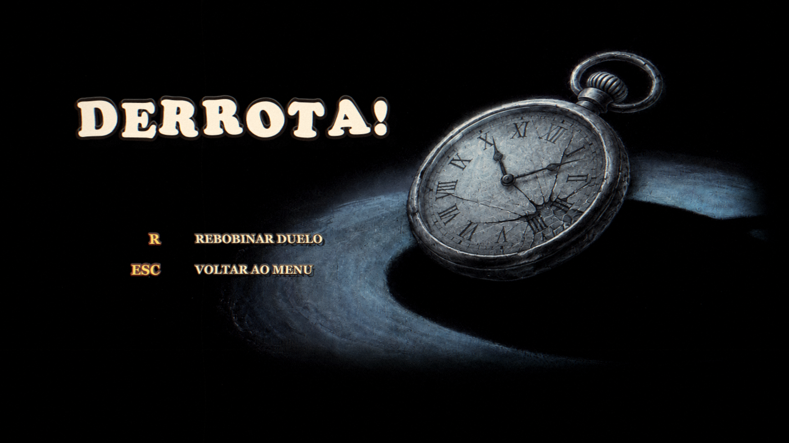

# Fúria Botânica

Boss fight 2D em Java, com estética de desenho animado vintage, arena floral e uma flor-chefe bem pouco amigável. O projeto usa LibGDX + LWJGL3 para entregar uma experiência desktop com movimento rápido, projéteis, dash, ataque especial, efeitos de tela e áudio.

## Screenshots

| Menu | Batalha | Derrota |
| --- | --- | --- |
|  |  |  |

## Sobre o jogo

Em **Fúria Botânica: O Jardim Maldito**, você controla um pequeno personagem-relógio em uma luta contra um boss floral. A batalha mistura movimentação precisa, leitura de padrões, ataques à distância e um especial carregável.

## Destaques

- Boss floral com máquina de estados, múltiplos ataques, avisos visuais e segunda fase.
- Jogador com pulo, dash, tiro contínuo, ataque especial, invencibilidade temporária, knockback e hitstop.
- Arena 2D com camadas de fundo vintage, partículas, camera shake, transição em íris e efeito de filme antigo.
- Menu, tela de vitória/derrota, sequência `READY?` / `GO!` e locuções de abertura/knockout.
- HUD com vida do jogador e relógio de carregamento do especial.

## Requisitos técnicos

- JDK 21 instalado e configurado no `JAVA_HOME`.
- Gradle Wrapper incluso no projeto.
- LibGDX `1.14.1`.
- Backend desktop LWJGL3.
- Sistema com suporte a OpenGL compatível com LibGDX/LWJGL3.

O jogo usa resolução interna de `1280x720` e abre em fullscreen pelo launcher desktop.

## Como executar

No Windows:

```powershell
.\gradlew.bat run
```

No Linux/macOS:

```bash
./gradlew run
```

Pelo IntelliJ IDEA:

1. Abra o projeto como um projeto Gradle.
2. Use o JDK 21.
3. Execute a task `run` ou a classe `com.bossfight.desktop.DesktopLauncher`.

Se o Gradle reclamar de JVM antiga, confira se `JAVA_HOME` aponta para um JDK 21 antes de rodar o wrapper.

## Controles

| Ação | Teclas |
| --- | --- |
| Mover para a esquerda | `A` ou `Seta esquerda` |
| Mover para a direita | `D` ou `Seta direita` |
| Pular | `W`, `Espaço` ou `Seta cima` |
| Atirar | `F` ou `Ctrl` |
| Dash | `K` ou `Shift` |
| Ataque especial | `G` ou `Alt` |
| Voltar ao menu | `Esc` |
| Tela final | `R` para lutar de novo, `Esc`/`Enter` para voltar ao menu |
| Alternar fullscreen | `Alt` + `Enter` |

## Organização do projeto

```text
src/main/java/com/bossfight
|-- desktop/   # Launcher LWJGL3
|-- screens/   # Menu, batalha e telas finais
|-- entities/  # Jogador, boss, projéteis e hitboxes
|-- boss/      # Estados e eventos da máquina de estados do boss
|-- systems/   # Áudio, colisão, partículas, projéteis, texto, fundo e efeitos
`-- Constants.java

assets/
|-- audio/     # Música, ambiência e locuções
`-- sprites/   # UI, boss, jogador, projéteis e cenário
```

## Assets e licenças

A documentação de origem e licenças dos assets está em [`docs/ASSETS_LICENSES.md`](docs/ASSETS_LICENSES.md). Os arquivos do jogo foram preparados para este projeto e não incluem assets oficiais de Cuphead.
