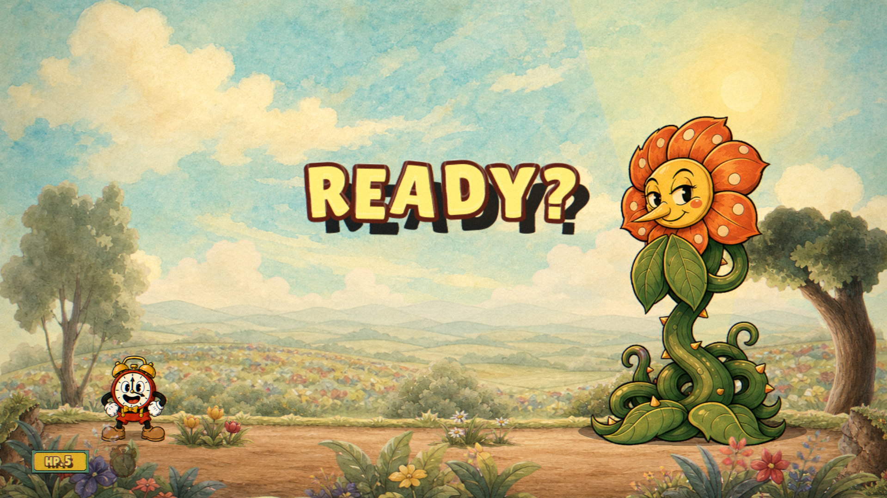

# Fúria Botânica

<p><samp>Java · libGDX · Programação Orientada a Objetos</samp></p>

Um boss fight 2D com combate rápido, padrões progressivos e estética de animação vintage.
Desenvolvido como trabalho da disciplina de **Programação Orientada a Objetos (POO)**.

[Gameplay](#gameplay) · [Como executar](#como-executar) · [Controles](#controles) · [Arquitetura](#arquitetura)



## Gameplay

https://github.com/user-attachments/assets/0798e6e3-3911-4118-8fe1-a1ccaabd6469

## Como executar

### Requisitos

- [JDK 21](https://adoptium.net/temurin/releases/?version=21) instalado e configurado no `JAVA_HOME`.
- Windows, Linux ou macOS com suporte a OpenGL compatível com LWJGL3.
- Git para clonar o repositório.

O Gradle Wrapper já está incluído; não é necessário instalar o Gradle separadamente.

### 1. Clone o projeto

```bash
git clone https://github.com/matrodrigs/java-bossfight.git
cd java-bossfight
```

### 2. Inicie o jogo

No Windows:

```powershell
.\gradlew.bat run
```

No Linux ou macOS:

```bash
chmod +x gradlew
./gradlew run
```

Na primeira execução, o Gradle baixa as dependências automaticamente. O launcher abre o jogo em tela cheia, usando uma resolução interna de `1280 × 720`.

<details>
<summary>Abrir no IntelliJ IDEA</summary>

1. Abra a pasta do repositório como um projeto Gradle.
2. Selecione o JDK 21 para o projeto.
3. Execute a task Gradle `run` ou a classe `com.bossfight.desktop.DesktopLauncher`.

</details>

## Controles

| Ação | Controle |
| --- | --- |
| Mover | `A` / `D` |
| Pular | `Espaço` |
| Dash | `Shift esquerdo` |
| Atirar | Segurar `botão esquerdo do mouse` |
| Ataque especial | `Botão direito do mouse` |
| Voltar ao menu | `Esc` |
| Alternar tela cheia | `F11` |

<details>
<summary>Controles dos menus e da revanche</summary>

| Ação | Controle |
| --- | --- |
| Navegar | `W` / `S` ou `↑` / `↓` |
| Confirmar | `Enter` ou `Espaço` |
| Jogar novamente | `R` na tela final |
| Voltar ao menu | `Esc` ou `Enter` na tela final |

</details>

## Destaques

- **Boss em múltiplas fases:** máquina de estados com padrões sorteados sem repetição imediata, transições próprias e uma etapa final mais agressiva.
- **Combate responsivo:** pulo com coyote time e input buffer, dash, tiro contínuo, especial carregável, knockback e hitstop.
- **Ataques legíveis:** telegraphs antecipam espinhos, sementes, bolotas, pólen e zonas de impacto.
- **Direção de arte vintage:** cenário em camadas, animações desenhadas, textura de filme antigo e transições em íris.
- **Feedback audiovisual:** partículas, camera shake, reações a acertos, locuções e trilhas que acompanham as fases da batalha.
- **Experiência completa:** menu, introdução `READY? / GO!`, HUD, vitória, derrota e revanche rápida.

<details>
<summary><strong>Como a batalha evolui (contém spoilers de gameplay)</strong></summary>

### Fase inicial

O boss alterna entre golpes de espinhos em diferentes alturas, rajadas direcionadas e chuva de pólen com áreas de queda sinalizadas.

### Segunda fase

Ao chegar à metade da vida, a flor altera a arena e acelera o ritmo. Novos padrões incluem corredores de esporos, vinhas verticais, obstáculos em arco e ataques encadeados.

### Fúria final

Nos últimos 20% de vida, o tempo de recuperação diminui e as sequências ficam mais intensas até o knockout.

</details>

## Tecnologias

| Tecnologia | Uso no projeto |
| --- | --- |
| **Java 21** | Código do jogo e recursos modernos da linguagem |
| **libGDX 1.14.1** | Loop principal, input, áudio, câmera e renderização 2D |
| **LWJGL3** | Backend desktop e integração com OpenGL |
| **Gradle 8.14.3** | Build, dependências e execução |
| **Java2D** | Geração das texturas de texto com as fontes do projeto |

## Arquitetura

O código separa regras de combate, apresentação e fluxo de telas para manter a luta fácil de evoluir:

<details>
<summary>Mapa do código e dos assets</summary>

```text
src/main/java/com/bossfight/
├── audio/       # Música, locuções e efeitos sonoros
├── boss/        # Boss, fases, ataques e telegraphs
├── config/      # Constantes de gameplay e da arena
├── desktop/     # Launcher LWJGL3
├── effects/     # Partículas, câmera, filme antigo e transições
├── entities/    # Jogador, projéteis e hitboxes
├── gameplay/    # Colisões e ciclo de vida dos projéteis
├── input/       # Leitura e buffer dos controles
├── rendering/   # Cenário, sprites, textos e HUD
└── screens/     # Menu, batalha e telas finais

assets/
├── audio/       # Músicas, ambiência, efeitos e locuções
├── fonts/       # Fontes empacotadas e suas licenças
└── sprites/     # Cenário, personagens, projéteis e interface
```

</details>

A lógica do boss usa o padrão **State**: cada ataque implementa seu próprio comportamento, telegraph e encerramento, enquanto `Boss` decide transições, fases e encadeamentos.

## Build de verificação

Para compilar o projeto sem iniciar o jogo:

```bash
./gradlew build
```

No Windows, use `.\gradlew.bat build`.

## Assets e créditos

Este projeto não inclui sprites, músicas, efeitos, logos ou fontes oficiais de *Cuphead*. A inspiração está na linguagem visual das animações clássicas. Os arquivos usados pelo jogo foram criados ou obtidos separadamente.

As origens e licenças de imagens, áudios e fontes estão documentadas em [`docs/ASSETS_LICENSES.md`](docs/ASSETS_LICENSES.md). Assets de terceiros permanecem sob suas licenças originais e não são relicenciados pela MIT.

## Licença

O código-fonte deste projeto está disponível sob a [Licença MIT](LICENSE).

<sub>Desenvolvido por <a href="https://github.com/matrodrigs">Mateus Rodrigues</a>.</sub>
